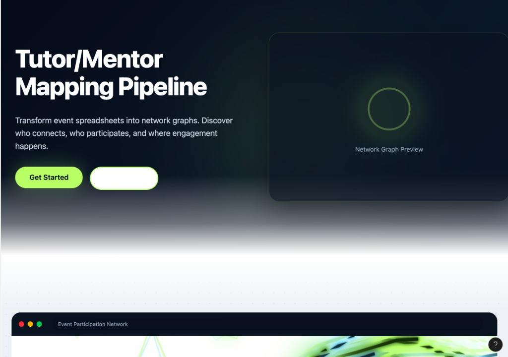

# NetworkMap - Event Network Visualization Platform

A full-stack web application for collecting, analyzing, and visualizing participant connections from events. Transform survey responses into interactive network graphs and analytics dashboards.



## 🌟 Features

### For Event Organizers (Admins)
- **📝 Dynamic Form Builder**: Create custom event forms with built-in participant and connection fields
- **📊 Analytics Dashboard**: Visualize participant demographics, connections, and network metrics
- **🔄 Data Export**: Export responses to CSV for use in Gephi, Kumu, or other network analysis tools
- **🎨 Network Conversion**: Automatically generate nodes and edges files from form responses

### For Participants
- **🌐 Smart Location Selection**: Country → State → City cascading dropdowns
- **🔗 Connection Tracking**: Record up to 5 organizational connections per participant
- **📱 Responsive Design**: Mobile-friendly form interface
- **✅ Data Validation**: Built-in validation for emails, phone numbers, and required fields

### Educational Content
- Interactive learning modules about network analysis
- Step-by-step guides for creating forms and analyzing data
- Best practices for event network mapping

## 🛠️ Tech Stack

### Frontend
- **React** - UI framework
- **React Router** - Navigation
- **Recharts** - Data visualization
- **Country-State-City** - Location data
- **PapaParse** - CSV parsing
- **Axios** - HTTP client

### Backend
- **Node.js** + **Express** - Server framework
- **MongoDB** + **Mongoose** - Database
- **JWT** - Authentication
- **Bcrypt** - Password hashing
- **CORS** - Cross-origin support

### Deployment
- **Netlify** - Frontend hosting
- **Render** - Backend hosting
- **MongoDB Atlas** - Database hosting

## 📦 Installation

### Prerequisites
- Node.js (v14 or higher)
- MongoDB (local or Atlas account)
- Git

### 1. Clone the Repository
```bash
git clone https://github.com/kishuxz/info_viz.git
cd info_viz/event-network-template
```

### 2. Install Dependencies

**Install frontend dependencies:**
```bash
npm install
```

**Install backend dependencies:**
```bash
cd backend
npm install
cd ..
```

### 3. Configure Environment Variables

**Backend (.env in `/backend` folder):**
```env
MONGODB_URI=your_mongodb_connection_string
JWT_SECRET=your_secure_random_string
NODE_ENV=development
PORT=5001
```

**Frontend (.env in root folder):**
```env
REACT_APP_API_URL=http://localhost:5001/api
```

> **Note**: Copy `.env.example` files and rename them to `.env`, then fill in your values.

### 4. Start the Application

**Terminal 1 - Start Backend:**
```bash
cd backend
npm start
```

**Terminal 2 - Start Frontend:**
```bash
npm start
```

Frontend runs on: `http://localhost:3000`  
Backend runs on: `http://localhost:5001`

## 🚀 Deployment Guide

### Deploy Backend to Render

1. **Create a Render account** at [render.com](https://render.com)
2. **Create a new Web Service** connected to your GitHub repo
3. **Configure settings:**
   - **Root Directory**: `backend`
   - **Build Command**: `npm install`
   - **Start Command**: `npm start`
   - **Environment**: Node
4. **Add environment variables:**
   ```
   MONGODB_URI=your_mongodb_atlas_uri
   JWT_SECRET=your_secure_secret
   NODE_ENV=production
   PORT=5001
   ```
5. **Deploy** and note your backend URL (e.g., `https://your-app.onrender.com`)

### Deploy Frontend to Netlify

1. **Create a Netlify account** at [netlify.com](https://netlify.com)
2. **Import your GitHub repository**
3. **Configure build settings:**
   - **Build command**: `npm run build`
   - **Publish directory**: `build`
4. **Add environment variable:**
   ```
   REACT_APP_API_URL=https://your-backend-url.onrender.com/api
   ```
5. **Deploy** and get your live URL

### MongoDB Atlas Setup

1. **Create account** at [mongodb.com/cloud/atlas](https://www.mongodb.com/cloud/atlas)
2. **Create a cluster** (free tier available)
3. **Create database user** with password
4. **Whitelist IP addresses**:
   - For Render: Add `0.0.0.0/0` (allows all IPs)
   - For local dev: Add your IP
5. **Get connection string** and add to your `.env` files

## 📖 Usage

### As an Admin

1. **Sign Up/Login** - Create an admin account
2. **Create a Form** - Go to Admin Dashboard → Create Form
   - Set event name and date
   - Add custom fields if needed
   - Save and get shareable form URL
3. **Share Form** - Send the form URL to event participants
4. **View Analytics** - Check the Analytics page for:
   - Participant demographics
   - Connection statistics
   - Network visualizations
5. **Export Data** - Download CSV for network analysis tools

### As a Participant

1. **Open Form Link** - Click the URL shared by organizer
2. **Fill Details**:
   - Personal information
   - Organization details
   - Location (country → state → city)
3. **Add Connections** - Record up to 5 organizational connections
4. **Submit** - Your data is securely saved

## 🔒 Security Features

- ✅ Password hashing with bcrypt
- ✅ JWT-based authentication
- ✅ Token blacklisting on logout
- ✅ Environment variable protection
- ✅ CORS configuration
- ✅ Input validation and sanitization

## 📁 Project Structure

```
event-network-template/
├── backend/                 # Node.js backend
│   ├── controllers/         # Request handlers
│   ├── models/             # Mongoose schemas
│   ├── routes/             # API routes
│   ├── middleware/         # Auth & validation
│   ├── config/             # Database config
│   └── server.js           # Entry point
├── src/                    # React frontend
│   ├── Components/         # React components
│   ├── services/           # API services
│   ├── utils/              # Helper functions
│   └── App.js             # Main app component
├── public/                 # Static assets
└── README.md              # This file
```

## 🤝 Contributing

Contributions are welcome! Please follow these steps:

1. Fork the repository
2. Create a feature branch (`git checkout -b feature/AmazingFeature`)
3. Commit your changes (`git commit -m 'Add some AmazingFeature'`)
4. Push to the branch (`git push origin feature/AmazingFeature`)
5. Open a Pull Request

## 📝 License

This project is open source and available under the [MIT License](LICENSE).

## 🐛 Known Issues

- Free tier on Render may spin down after inactivity (cold starts)
- Large CSV exports may take time to process
- Network graph rendering limited to 1000 nodes for performance

## 🔮 Future Enhancements

- [ ] Real-time collaboration on forms
- [ ] Advanced network metrics (betweenness, closeness)
- [ ] Interactive D3.js network visualization
- [ ] Multi-language support
- [ ] Email notifications
- [ ] Role-based access control

## 📧 Support

- **Issues**: [GitHub Issues](https://github.com/kishuxz/info_viz/issues)
- **Discussions**: [GitHub Discussions](https://github.com/kishuxz/info_viz/discussions)

## 🙏 Acknowledgments

Built for event organizers, researchers, and community builders who want to understand and visualize organizational networks.

---

**Made with ❤️ for the open-source community**
